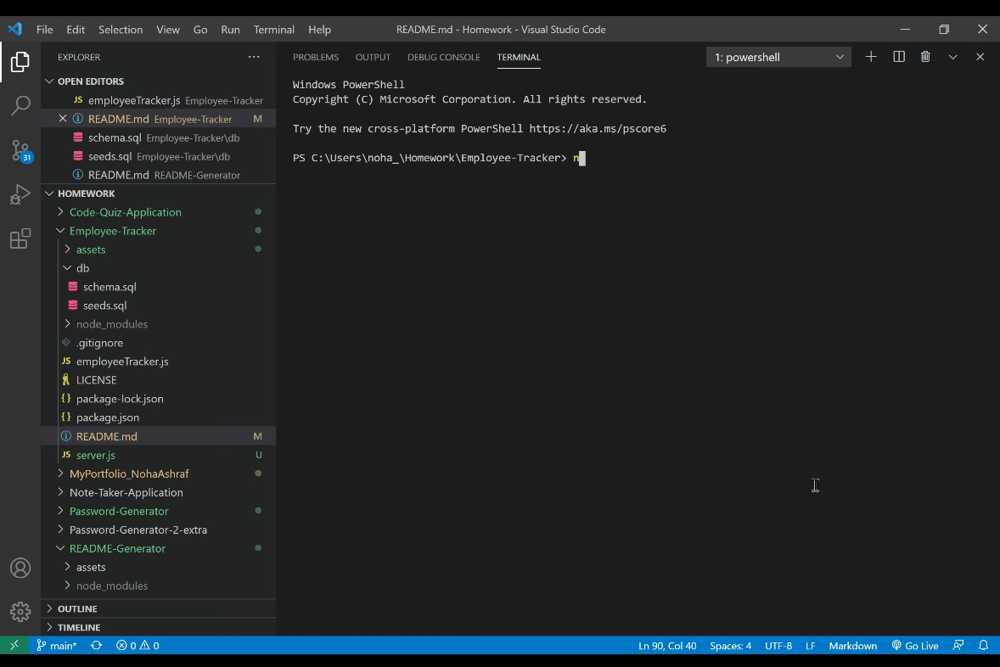

# Employee Management System
## Description
The Employee Management System is a Command Line Application (CLI), that provides the user with the ability to add and update the information that are related to the employee in a company.

For a full demo of the application: [Employee-Management-System](https://drive.google.com/file/d/1vHbpQcUUHZ_-IGCeIEn4AeJt-71Leg8h/view)

## Table of Contents

[Description](#description)

[Technologies-&-tools-used](#Technologies-&-tools-used)

[Installation](#Installation)

[Usage](#usage)

[How-it-Works](#How-it-Works)

[License](#License)

[Badges](#Badges)

[Contributing](#contributing)

[Tests](#tests)

[Questions](#questions)

## Technologies & tools used
1. JavaScript
2. Node.js
3. MySQL Workbench
4. MySQL npm package
5. InquierrJs
6. console.table

## Installation
To install the application follow the following steps:
1. Clone the repo on your local machine
2. Install the [inquirer package](https://www.npmjs.com/package/inquirer) to prompt the list of questions through `npm install inquirer` command
3. Install the [mysql package](https://www.npmjs.com/package/mysql) through `npm install mysql` command
4. Install the [console.table package](https://www.npmjs.com/package/console.table) through `npm install console.table` command
Install the [sync-mysql package](https://www.npmjs.com/package/sync-mysql) through the command `npm install sync-mysql` command

## Usage
This Employee Management System is designed as a CLI application to make it easy for none developers to interact with information stored in an employee database and be able to add or update team member's information in an organization. This information includes but not limited to, employees names, salary, role, managers, which department they belong to.

## How It Works
Upon opening Visual Studio Code (VSC), right click on the `<employeeTracker.js>` file and open it in the Integrated Terminal in VSC, the applicaiton is invoked through typing the command `Node employeeTracker.js` in the Integrated Terminal

Within the Integrated Terminal a list of questions prompted through the usage of the inquirer package.

The list of questions are designed to help the user chose from a list of questions what they wish to accomplish.

### View all employees
In the first option the system provides is to View all employees in the system, this option provides the user with a table that lists all the information in the database using JOINTS as illustrated below.

### View all employees by department
In the second option the system provides is to View all employees by department, this option prompts the user to answer another question that provides a choice for the department the user wished to view the employees that belong to it. 

### View all employees by manager
In the third option the system provides is to View all employees by manager, this option prompts the user to chose froma list which manager the user wished to view the employees that belong to him/her.

### View all employees by role
In the fourth option the system provides is to View all employees by role, this option prompts the user to chose froma list which role the user wished to view .

### View all departments
In the fifth option the system provides a list of the availabile departments in the database of the Employee Management System.

### View all roles
In the sixth option the system provides a list of the availabile roles in the database of the Employee Management System.

### Add Department
In the seventh option the system provides the user with the option to add a new department to the database of the Employee Management System using the CLI. Once the user chooses to add a department, a question will prompt the user to enter the name of the department they would like to add, once the department is added a message will appeare that a new department has been added. 

### Add Role
In the eighth option the system provides the user with the option to add a new role to the database of the Employee Management System using the CLI. Once the user chooses to add a role, a question will prompt the user to enter the name of the role they would like to add and the salary that corresponds to that new role, once the role is added a message will appeare that a new role has been added. 

### Add Employee
In the ninth option the system provides the user with the option to add a new employee to the database of the Employee Management System using the CLI. Once the user chooses to add an employee, a question will prompt the user to enter the first name, last name chose a title from the list of titles available and chose the manager from the list of employees available in the database, once the employee is added a message will appeare that a new employee has been added. 

### Update employee role
In the ninth option the system provides the user with the option to update an employee's role in the database of the Employee Management System using the CLI. Once the user chooses to update an employee's role, the user will be presented with a list of choices of available employees to chose which employee they wish to change the rold of, upon chosing the employee, the user will be presented with a list of choices from the available roles to change the employee's role to. 

### Quit
Once the user is satisfied with all the updates, they can chose quit and the application quits and shows the user a Good Bye message.

## License

## Badges

## Contributing 

To contribute to this project, please make sure you follow the guidelines in [The Contributor Covenant](https://www.contributor-covenant.org/) as general guidelines.
Kindly maintain the highest ethics and respect. For further questions or requests kindly contact me through my [Email](mailto:noha_ashraf85@hotmail.com) or [GitHub](https://github.com/NohaAshraf85).

## Tests 
The Employee Management System's database has been tested using MySQL Workbench.

## Questions
For any questions, please contact me through [GitHub](https://github.com/NohaAshraf85) 
or [Email](mailto:noha_ashraf85@hotmail.com)

